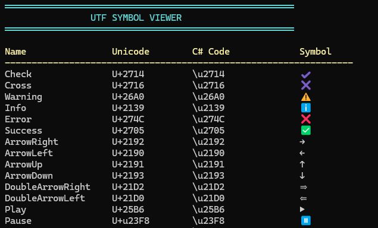

# Console.UTFSymbols


## Projekt 
In dem Projekt soll gezeigt werden, wie UTF Symbole als Darstellung in einer Konsolenanwendung verwendet werden kann.



## Hinweis
Der Source ist soll auch einfache Art und Weise die Funktionen eines Features zeigen. Der Source ist so geschrieben, das so wenig wie möglich zusätzliche NuGet-Pakete benötigt werden.

## Beispielsource

Beispielhafter Auszug der Klasse `UTFSymbols` in der die UTF Symbole abgelegt sind, über die Methoden `Get`und `GetAll` gelesen werden können.
Die Werte sind in einem `Dictionary<string, (string, string, string)>` abgelegt. So kann der eigentliche UTF Code als auch das Symbol selbst dargestellt werden. 
```csharp
    public static class UTFSymbols
    {
        static UTFSymbols()
        {
            Console.OutputEncoding = Encoding.UTF8;
        }

        private static readonly Dictionary<string, (string, string, string)> _symbols = new()
        {
        // Status
        { nameof(Check), ("U+2714", @"\u2714","\u2714") },
        ...
    };

        public static string Get(string name)
        {
            string result = string.Empty;
            var enumerator = _symbols.GetEnumerator();
            while (enumerator.MoveNext())
            {
                // Zugriff auf den aktuellen KeyValuePair
                KeyValuePair<string, (string, string, string)> current = enumerator.Current;
                if (name.ToLower() == current.Key.ToLower())
                {
                    result = current.Value.Item3;
                    break;
                }
            }

            return result;
        }

        public static IReadOnlyDictionary<string, (string, string, string)> GetAll => _symbols;

        #region Properties mit Symbolen zurückgeben
        // Status
        public static (string, string, string) Check => _symbols[nameof(Check)];
        #endregion Properties mit Symbolen zurückgeben
    }
```

## Verwendung


```csharp
Console.WriteLine($"{UTFSymbols.Get("check")}\tPrüfen");

Console.WriteLine($"{UTFSymbols.Check.Item3}\tPrüfen");
```


# Versionshistorie

- Erste Version
